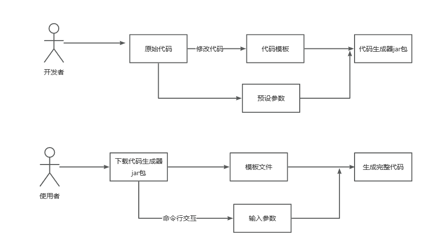
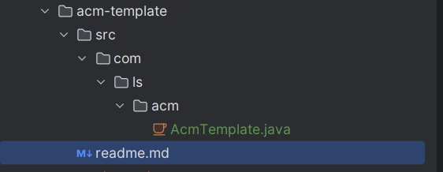

## 项目介绍

代码生成器项目，生成代码模板。


## 项目拆解

* 基于命令行生成代码


## 第一阶段本地代码生成器

主要目的：基于命令行方式开发代码生成器，也就是开发一个脚手架。

### 核心思路

完整代码 = **静态代码** + **动态模板** + **动态参数**。

代码生成是根据一个项目代码的模板以及传入一些参数来选择是否需要，来生成完整的代码。

对于**静态代码**也就是通用的不需要改变的代码，怎么生成？

直接**复制代码文件**就好，或则pull远程仓库中的模板代码。

### 业务流程

1. 准备模板代码，用于后续生成
2. 基于模板代码，设置参数，编写动态的模板
3. 制作可以可交互的命令行工具，支持用户输入参数，得到代码生成器jar包
4. 使用者可以下载制作好的jar包，执行程序并输入参数，从而生成完整代码。

业务流程图如下：



### 实现思路

1. 根据原始代码，可以生成一样的代码，可以两种方式，一种是copy，一种是pull。
2. 根据原始代码，预设部分动态的参数，编写模板文件，能够出入配置对象进行生成
3. 制作命令行工具，接受用户输入参数，动态生成代码
4. 封装代码生成器jar包，简化使用命令


问题拆解

1. 如何根据一套项目文件，完整的生成一套项目？（copy 或则pull）
2. 如何编写动态模板文件以及根据参数生成代码。
3. 如何制作命令行？接受用户输入
4. 怎么将命令行工具打给别人使用。


### 项目初始化

jdk 1.8

准备代码模板

```java
import java.util.Scanner;

/**
 * ACM 输入模板（多数之和）
 */
public class MainTemplate {
    public static void main(String[] args) {
        Scanner scanner = new Scanner(System.in);

        while (scanner.hasNext()) {
            // 读取输入元素个数
            int n = scanner.nextInt();

            // 读取数组
            int[] arr = new int[n];
            for (int i = 0; i < n; i++) {
                arr[i] = scanner.nextInt();
            }

            // 处理问题逻辑，根据需要进行输出
            // 示例：计算数组元素的和
            int sum = 0;
            for (int num : arr) {
                sum += num;
            }

            System.out.println("Sum: " + sum);
        }

        scanner.close();
    }
}

```

模板代码分析



readme.md代码不需要更改，属于”静态文件“，直接复制。 

java代码我们要根据我们预设的参数生成完整代码。

比如现在的代码是一直循环输入

```java
Scanner scanner = new Scanner(System.in);

while (scanner.hasNext()) {
    // 读取输入元素个数
    int n = scanner.nextInt();
    ...
    System.out.println("Sum: " + sum);
}

```

但是如果用户不需要一直循环输入，只保留其他代码如下

```java
Scanner scanner = new Scanner(System.in);

// 读取输入元素个数
int n = scanner.nextInt();
...
System.out.println("Sum: " + sum);

```

也就是说，该java代码是"动态的"，根据用户输入的参数来生成不同的代码。

创建maven项目

依赖

```xml
<dependencies>
    <!-- https://doc.hutool.cn/ -->
    <dependency>
        <groupId>cn.hutool</groupId>
        <artifactId>hutool-all</artifactId>
        <version>5.8.16</version>
    </dependency>
    <!-- https://mvnrepository.com/artifact/org.apache.commons/commons-collections4 -->
    <dependency>
        <groupId>org.apache.commons</groupId>
        <artifactId>commons-collections4</artifactId>
        <version>4.4</version>
    </dependency>
    <!-- https://projectlombok.org/ -->
    <dependency>
        <groupId>org.projectlombok</groupId>
        <artifactId>lombok</artifactId>
        <version>1.18.30</version>
        <scope>provided</scope>
    </dependency>
    <dependency>
        <groupId>junit</groupId>
        <artifactId>junit</artifactId>
        <version>4.13.2</version>
        <scope>test</scope>
    </dependency>
</dependencies>

```

