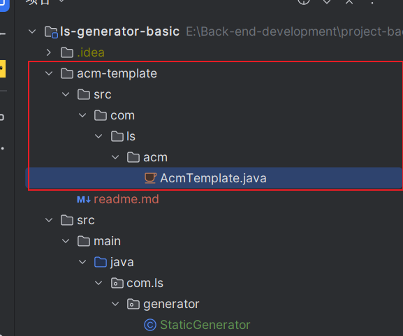
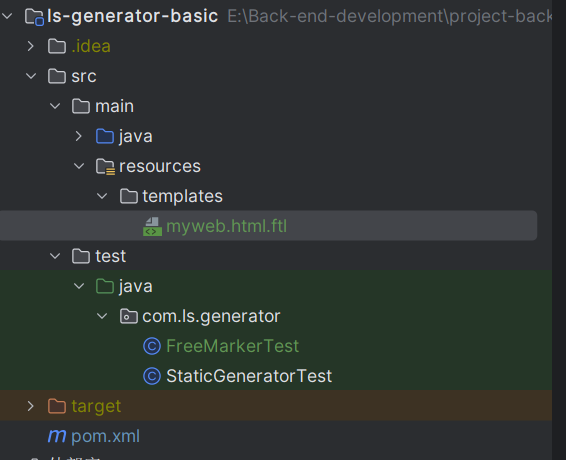
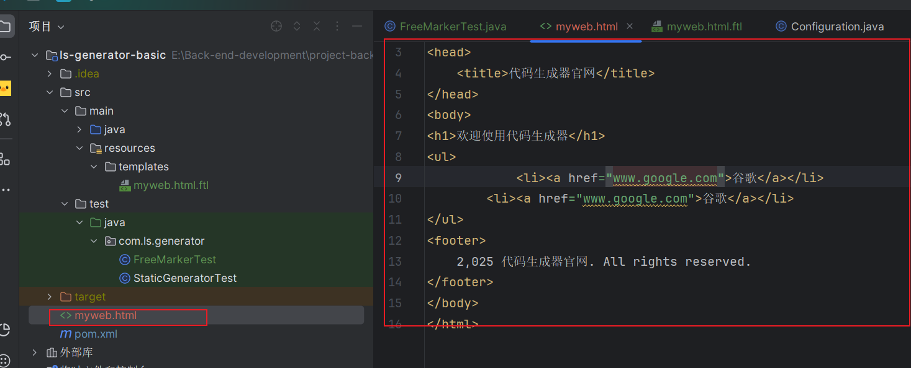
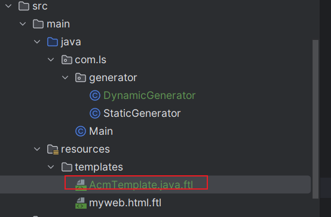
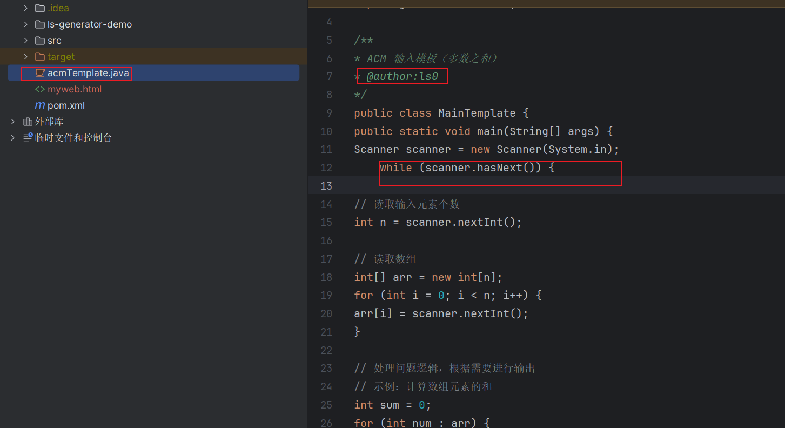

## 项目介绍

代码生成器项目，生成代码模板。


## 项目拆解

* 基于命令行生成代码


## 第一阶段本地代码生成器

主要目的：基于命令行方式开发代码生成器，也就是开发一个脚手架。

### 核心思路

完整代码 = **静态代码** + **动态模板** + **动态参数**。

代码生成是根据一个项目代码的模板以及传入一些参数来选择是否需要，来生成完整的代码。

对于**静态代码**也就是通用的不需要改变的代码，怎么生成？

直接**复制代码文件**就好，或则pull远程仓库中的模板代码。

### 业务流程

1. 准备模板代码，用于后续生成
2. 基于模板代码，设置参数，编写动态的模板
3. 制作可以可交互的命令行工具，支持用户输入参数，得到代码生成器jar包
4. 使用者可以下载制作好的jar包，执行程序并输入参数，从而生成完整代码。

业务流程图如下：


### 实现思路

1. 根据原始代码，可以生成一样的代码，可以两种方式，一种是copy，一种是pull。
2. 根据原始代码，预设部分动态的参数，编写模板文件，能够出入配置对象进行生成
3. 制作命令行工具，接受用户输入参数，动态生成代码
4. 封装代码生成器jar包，简化使用命令


问题拆解

1. 如何根据一套项目文件，完整的生成一套项目？（copy 或则pull）
2. 如何编写动态模板文件以及根据参数生成代码。
3. 如何制作命令行？接受用户输入
4. 怎么将命令行工具打给别人使用。


### 项目初始化

jdk 1.8

准备代码模板

```java
import java.util.Scanner;

/**
 * ACM 输入模板（多数之和）
 */
public class MainTemplate {
    public static void main(String[] args) {
        Scanner scanner = new Scanner(System.in);

        while (scanner.hasNext()) {
            // 读取输入元素个数
            int n = scanner.nextInt();

            // 读取数组
            int[] arr = new int[n];
            for (int i = 0; i < n; i++) {
                arr[i] = scanner.nextInt();
            }

            // 处理问题逻辑，根据需要进行输出
            // 示例：计算数组元素的和
            int sum = 0;
            for (int num : arr) {
                sum += num;
            }

            System.out.println("Sum: " + sum);
        }

        scanner.close();
    }
}

```

创建maven项目

依赖

```xml
<dependencies>
    <!-- https://doc.hutool.cn/ -->
    <dependency>
        <groupId>cn.hutool</groupId>
        <artifactId>hutool-all</artifactId>
        <version>5.8.16</version>
    </dependency>
    <!-- https://mvnrepository.com/artifact/org.apache.commons/commons-collections4 -->
    <dependency>
        <groupId>org.apache.commons</groupId>
        <artifactId>commons-collections4</artifactId>
        <version>4.4</version>
    </dependency>
    <!-- https://projectlombok.org/ -->
    <dependency>
        <groupId>org.projectlombok</groupId>
        <artifactId>lombok</artifactId>
        <version>1.18.30</version>
        <scope>provided</scope>
    </dependency>
    <dependency>
        <groupId>junit</groupId>
        <artifactId>junit</artifactId>
        <version>4.13.2</version>
        <scope>test</scope>
    </dependency>
</dependencies>

```

### 实现流程

明确目的：制作一个代码生成器的脚手架。

任务拆解：在本地做一个代码生成器 + 基于命令行的脚手架。

模板代码分析


readme.md代码不需要更改，属于”静态文件“，直接复制。 

java代码我们要根据我们预设的参数生成完整代码。

比如现在的代码是一直循环输入

```java
Scanner scanner = new Scanner(System.in);

while (scanner.hasNext()) {
    // 读取输入元素个数
    int n = scanner.nextInt();
    ...
    System.out.println("Sum: " + sum);
}

```

但是如果用户不需要一直循环输入，只保留其他代码如下

```java
Scanner scanner = new Scanner(System.in);

// 读取输入元素个数
int n = scanner.nextInt();
...
System.out.println("Sum: " + sum);

```

也就是说，该java代码是"动态的"，根据用户输入的参数来生成不同的代码。

通过上个步骤可以分为生成**静态文件** + **动态文件**。

在思考如何制作基于命令行的脚手架，在做脚手架之前可以通过运行Main方法生成代码。然后改变参数的输入方式，在命令行获取参数复用逻辑，在改变执行方式调用jar包

实现步骤

1. 生成静态文件，通过main方法执行
2. 生成动态文件，通过main方法执行
3. 同时生成静态文件+动态文件，通过main方法执行，得到完整代码
4. 开发命令行工具，接受参数生成要求代码

### 生成静态代码思路以及实现

使用hutool工具copy。

```java
public class StaticGenerator {
    public static void copyFilesByhutool(String inputPath,String outputPath) {
        FileUtil.copy(inputPath,outputPath,false);
    }
}
```

hutool源代码如下

```java
	/**
	 * 复制文件或目录<br>
	 * 如果目标文件为目录，则将源文件以相同文件名拷贝到目标目录
	 *
	 * @param srcPath    源文件或目录
	 * @param destPath   目标文件或目录，目标不存在会自动创建（目录、文件都创建）
	 * @param isOverride 是否覆盖目标文件
	 * @return 目标目录或文件
	 * @throws IORuntimeException IO异常
	 */
	public static File copy(String srcPath, String destPath, boolean isOverride) throws IORuntimeException {
		return copy(file(srcPath), file(destPath), isOverride);
	}
```

编写main方法

```java
public class Main {
    public static void main(String[] args) {
        // 获取整个项目的根路径
        String projectPath = System.getProperty("user.dir");
//        System.out.println("projectPath = " + projectPath);
        // 获取项目根路径的父路径
        File parentFile = new File(projectPath).getParentFile();
//        System.out.println("parentFile = " + parentFile);
        // 输入路径：ACM 示例代码模板目录
        String inputPath = new File(parentFile, "ls-generator-demo/acm-template").getAbsolutePath();
        // 输出路径：直接输出到项目的根目录
        String outputPath = projectPath;
        StaticGenerator.copyFilesByhutool(inputPath, outputPath);
    }
}
```

测试

确实生成了



这样好处就是使用简单，但是没办法自定义那个文件要生成那个文件不要复制。

对于该demo而言，只需要copy `readme.md`文档以及各个目录。

可以自己递归实现文件的遍历。

```java
/**
     * 递归拷贝文件（递归实现，会将输入目录完整拷贝到输出目录下）
     * @param inputPath
     * @param outputPath
     */
    public static void copyFilesByRecursive(String inputPath, String outputPath) {
        File inputFile = new File(inputPath);
        File outputFile = new File(outputPath);
        try {
            copyFileByRecursive(inputFile, outputFile);
        } catch (Exception e) {
            System.err.println("文件复制失败");
            e.printStackTrace();
        }
    }

    /**
     * 文件 A => 目录 B，则文件 A 放在目录 B 下
     * 文件 A => 文件 B，则文件 A 覆盖文件 B
     * 目录 A => 目录 B，则目录 A 放在目录 B 下
     *
     * 核心思路：先创建目录，然后遍历目录内的文件，依次复制
     * @param inputFile
     * @param outputFile
     * @throws IOException
     */
    private static void copyFileByRecursive(File inputFile, File outputFile) throws IOException {
        // 区分是文件还是目录
        if (inputFile.isDirectory()) {
            System.out.println(inputFile.getName());
            File destOutputFile = new File(outputFile, inputFile.getName());
            // 如果是目录，首先创建目标目录
            if (!destOutputFile.exists()) {
                destOutputFile.mkdirs();
            }
            // 获取目录下的所有文件和子目录
            File[] files = inputFile.listFiles();
            // 无子文件，直接结束
            if (ArrayUtil.isEmpty(files)) {
                return;
            }
            for (File file : files) {
                // 递归拷贝下一层文件
                copyFileByRecursive(file, destOutputFile);
            }
        } else {
            // 是文件，直接复制到目标目录下
            Path destPath = outputFile.toPath().resolve(inputFile.getName());
            Files.copy(inputFile.toPath(), destPath, StandardCopyOption.REPLACE_EXISTING);
        }
    }


    /**
     * 递归遍历文件
     * @param directory
     */
    public static void traverseFiles(File directory) {
        // 如果是目录
        if (directory.isDirectory()) {
            // 获取当前目录下的所有文件和子目录
            File[] files = directory.listFiles();

            if (files != null) {
                // 遍历每一个文件和子目录
                for (File file : files) {
                    // 如果是文件，复制文件
                    if (file.isFile()) {

                    }
                    // 如果是目录，递归调用
                    else if (file.isDirectory()) {
                        System.out.println("Directory: " + file.getAbsolutePath());
                        traverseFiles(file); // 递归遍历子目录
                    }
                }
            }
        }
```

测试

```java 
/**
     * 递归遍历文件测试
     * @param directory
     */
    public static void traverseFiles(File directory) {
        // 如果是目录
        if (directory.isDirectory()) {
            // 获取当前目录下的所有文件和子目录
            File[] files = directory.listFiles();

            if (files != null) {
                // 遍历每一个文件和子目录
                for (File file : files) {
                    // 如果是文件，复制文件
                    if (file.isFile()) {

                    }
                    // 如果是目录，递归调用
                    else if (file.isDirectory()) {
                        System.out.println("Directory: " + file.getAbsolutePath());
                        traverseFiles(file); // 递归遍历子目录
                    }
                }
            }
        }
    }
```

测试正常


### 动态代码生成思路

明确需求 

1. 在原始代码上 添加 @author hnsqls  注解（添加代码）

				2. 更改输出的信息  （替换代码）
   				3. 可选循环或者仅一次（可选代码）

如下例子

```java 

import java.util.Scanner;

/**
 * ACM 输入模板（多数之和）
 * @author yupi（1. 增加作者注释）
 */
public class MainTemplate {
    public static void main(String[] args) {
        Scanner scanner = new Scanner(System.in);

    // 2. 可选是否循环
//        while (scanner.hasNext()) {
            // 读取输入元素个数
            int n = scanner.nextInt();

            // 读取数组
            int[] arr = new int[n];
            for (int i = 0; i < n; i++) {
                arr[i] = scanner.nextInt();
            }

            // 处理问题逻辑，根据需要进行输出
            // 示例：计算数组元素的和
            int sum = 0;
            for (int num : arr) {
                sum += num;
            }

            // 3. 输出信息可以修改
            System.out.println("求和结果: " + sum);
//        }

        scanner.close();
    }
}


```

那么怎么进行模板的”挖坑“与替换呢？可以使用模板引擎

### 模板引擎FreeMarker

#### 什么是模板引擎

模板引擎（Template Engine）是一种通过**预定义模板**和**动态数据**生成最终内容的工具。它常用于动态内容的生成，如 HTML 页面、配置文件、邮件模板，甚至是代码生成。模板引擎的基本思想是将用户的输入（或数据）和模板文件进行合并，生成最终的输出结果。

在 Java 中，常见的模板引擎有 **FreeMarker**、**Thymeleaf**、**Velocity** 和 **Mustache** 等。不同的模板引擎有不同的特性，选择合适的引擎取决于应用场景和需求。

#### 什么是FreeMarker

FreeMarker 是一个功能强大的模板引擎，广泛用于生成各种格式的文本，如 HTML、XML、配置文件、Java 代码等。它提供了强大的模板语言，支持条件判断、循环、宏定义等功能。而且不依赖其他环境,所有的java项目都可以使用.

>  官方文档 :[Apache FreeMarker Manual](https://freemarker.apache.org/docs/index.html)


#### 模板

模板由四部分组成

+ **文本**：不会改变的内容。
+ **插值**：这些部分将被计算出的值替换。`${``}``#{``}`
+ **FTL 标签**：FTL 标签与 HTML 标签有点相似，但它们是 FreeMarker 的指令，不会打印到 输出 ,通过<#xxx ......>来实现各种功能,比如<#list elements as element>实现循环。
+ **注释**：注释类似于 HTML 注释,`<#--``-->`

例子

```html
<!DOCTYPE html>
<html>
  <head>
    <title>代码生成器官网</title>
  </head>
  <body>
    <h1>欢迎使用代码生成器</h1>
    <ul>
      <#-- 循环渲染导航条 -->
      <#list menuItems as item>
        <li><a href="${item.url}">${item.label}</a></li>
      </#list>
    </ul>
    <#-- 底部版权信息（注释部分，不会被输出）-->
      <footer>
        ${currentYear} 代码生成器官网. All rights reserved.
      </footer>
  </body>
</html>
```


#### 数据模型

模板需要的数据成为数据模型.

在FreeMarker中数据模型是树形结构,或则hashMap结构.

```json
{
  "currentYear": 2025,
  "menuItems": [
    {
      "url": "https://xxxx.cn",
      "label": "xxx",
    },
    {
      "url": "https://xxx.com",
      "label": "xxxx",
    }
  ]
}
```

#### FreeMarker实战

1. 引入依赖

   ```xml
   <!-- https://freemarker.apache.org/index.html -->
   <dependency>
       <groupId>org.freemarker</groupId>
       <artifactId>freemarker</artifactId>
       <version>2.3.32</version>
   </dependency>
   
   ```

   如果是springboot项目

   ```xml
   <dependency>
     <groupId>org.springframework.boot</groupId>
     <artifactId>spring-boot-starter-freemarker</artifactId>
   </dependency>
   ```

   

2. 编写配置类

   ```java
   //// 创建FreeMarker配置实例
           Configuration configuration = new Configuration(Configuration.VERSION_2_3_32);
   
           // 指定模板文件的所在路径
           configuration.setDirectoryForTemplateLoading(new File("./src/main/resources/templates"));
   
           //设置默认编码
           configuration.setDefaultEncoding("UTF-8");
   ```

3. 准备模板

   在resource下新建templates目录,新建模板文件

   

   ```html
   <!DOCTYPE html>
   <html>
     <head>
       <title>代码生成器官网</title>
     </head>
     <body>
       <h1>欢迎使用代码生成器</h1>
       <ul>
         <#-- 循环渲染导航条 -->
         <#list menuItems as item>
           <li><a href="${item.url}">${item.label}</a></li>
         </#list>
       </ul>
       <#-- 底部版权信息（注释部分，不会被输出）-->
         <footer>
           ${currentYear} 代码生成器官网. All rights reserved.
         </footer>
     </body>
   </html>
   ```

   准备好模板文件后,使用创建模板对象来获取模板

   ```java
   // 创建模板对象，加载指定模板
   Template template = configuration.getTemplate("myweb.html.ftl");
   
   ```

   

4. 准备数据模型

   可以使用对象来传输数据,也可以一个map对象来传输数据

   ```Java
   //创建数据模型
           Map<String,Object> dataModel = new HashMap<String,Object>();
           dataModel.put("currentYear", LocalDate.now().getYear());
   
           ArrayList<Map<String, String>> lists = new ArrayList<>();
           HashMap<String, String> map = new HashMap<>();
           map.put("url","www.baidu.com");
           map.put("label","百度");
           lists.add(map);
           map.clear();
           map.put("url","www.google.com");
           map.put("label","谷歌");
           lists.add(map);
   
           dataModel.put("menuItems",lists);
   
   ```

5. 指定生成的文件路径以及名称

```java
Writer out = new FileWriter("myweb.html");
```

6. 生成文件

```java
template.process(dataModel, out);

// 生成文件后别忘了关闭哦
out.close();

```

完整测试代码

```java
package com.ls.generator;

import freemarker.template.Configuration;
import freemarker.template.Template;
import freemarker.template.TemplateException;
import org.junit.Test;

import java.io.File;
import java.io.FileWriter;
import java.io.IOException;
import java.time.LocalDate;
import java.util.ArrayList;
import java.util.HashMap;
import java.util.Map;

public class FreeMarkerTest {
    @Test
    public  void freeMarkerTest() throws IOException, TemplateException {
        //// 创建FreeMarker配置实例
            Configuration configuration = new Configuration(Configuration.VERSION_2_3_32);

            // 指定模板文件的所在路径
            configuration.setDirectoryForTemplateLoading(new File("./src/main/resources/templates"));

            //设置默认编码
            configuration.setDefaultEncoding("UTF-8");

        //加载模板
        Template template = configuration.getTemplate("myweb.html.ftl");


        //创建数据模型
        Map<String,Object> dataModel = new HashMap<String,Object>();
        dataModel.put("currentYear", LocalDate.now().getYear());

        ArrayList<Map<String, String>> lists = new ArrayList<>();
        HashMap<String, String> map = new HashMap<>();
        map.put("url","www.baidu.com");
        map.put("label","百度");
        lists.add(map);
        map.clear();
        map.put("url","www.google.com");
        map.put("label","谷歌");
        lists.add(map);

        dataModel.put("menuItems",lists);

        // 指定生成的文件 路径以及名称
        FileWriter out = new FileWriter("myweb.html");
        // 生成代码
        template.process(dataModel, out);

        out.close();


    }

}

```

测试通过



#### 常用语法

[FreeMarker教程网](http://www.freemarker.net/)

1. 插值

```java
表达式：${100 + money}
```

2. 分支判断

```java
<#if user == "ls">
  我是ls
<#else>
  我是xx
</#if>

```

3. 默认值

```java
${user!"用户为空"}
```

4. 循环

```java
<#list users as user>
  ${user}
</#list>
```

5. 宏定义

```java
<#macro card userName>     
---------    
${userName}
---------
</#macro>

```

```java
<@card userName="ls"/>
<@card userName="xx"/>

```

6. 内建函数

```java
${userName?upper_case}
${myList?size}

<#list users as user>
  ${user?index}
</#list>
```


### 动态代码生成实现

编写模板

```java


import java.util.Scanner;

/**
* ACM 输入模板（多数之和）
* @author:${author}
*/
public class MainTemplate {
public static void main(String[] args) {
Scanner scanner = new Scanner(System.in);
<#if isWhile>
    while (scanner.hasNext()) {
</#if>

// 读取输入元素个数
int n = scanner.nextInt();

// 读取数组
int[] arr = new int[n];
for (int i = 0; i < n; i++) {
arr[i] = scanner.nextInt();
}

// 处理问题逻辑，根据需要进行输出
// 示例：计算数组元素的和
int sum = 0;
for (int num : arr) {
sum += num;
}

System.out.println("Sum: " + sum);
<#if isWhile>
    }
</#if>


scanner.close();
}
}

```

数据,可以编写一个java类,或者一个hashmap

将模板代码放在resources/template下



开发动态生成的代码

```java
package com.ls.generator;

import freemarker.template.Configuration;
import freemarker.template.Template;
import freemarker.template.TemplateException;

import java.io.File;
import java.io.FileWriter;
import java.io.IOException;
import java.util.HashMap;

public class DynamicGenerator {
    public static void dynamicGenerator(String author,String output ,Boolean isWhile) throws IOException, TemplateException {
        Configuration configuration = new Configuration(Configuration.VERSION_2_3_32);
        configuration.setDirectoryForTemplateLoading(new File("./src/main/resources/templates"));

        configuration.setDefaultEncoding("UTF-8");

        //加载模板
        Template template = configuration.getTemplate("AcmTemplate.java.ftl");

        // 构造数据
        HashMap<String, Object> data = new HashMap<>();
        data.put("author", author);
        data.put("output", output);
        data.put("isWhile", isWhile);

        // 生成动态代码位置
        FileWriter out = new FileWriter("acmTemplate.java");

        // 生成动态代码
        template.process(data, out);

        out.close();


    }

}

```

测试类

```java
public class DynamicGeneratorTest extends TestCase {
    public static void main(String[] args) throws TemplateException, IOException {
        DynamicGenerator.dynamicGenerator("ls0","总和是",true);
    }

}
```

测试成功



测试发现，FreeMarker在接受参数时非空参数会报错。可以设置一个数据模型提取成java对象，赋予默认值。或则在模板中赋予默认值

以下时模板赋予默认值

```java

import java.util.Scanner;

/**
* ACM 输入模板（多数之和）
* @author:${author!"hnsqls"}
*/
public class MainTemplate {
public static void main(String[] args) {
Scanner scanner = new Scanner(System.in);
<#if (isWhile!false)>
    while (scanner.hasNext()) {
</#if>

// 读取输入元素个数
int n = scanner.nextInt();

// 读取数组
int[] arr = new int[n];
for (int i = 0; i < n; i++) {
arr[i] = scanner.nextInt();
}

// 处理问题逻辑，根据需要进行输出
// 示例：计算数组元素的和
int sum = 0;
for (int num : arr) {
sum += num;
}

System.out.println("${output!"sum"}: " + sum);
<#if (isWhile!false)>
    }
</#if>


scanner.close();
}
}

```

* 设置默认值   变量名!"默认值"
* 在使用if 并且对boolean类型设置默认值的时候`<#if (isWhile!false)>`